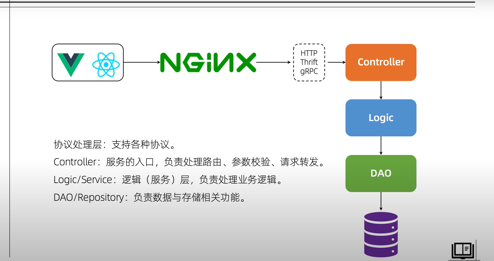

## goweb  开发模板





>  其他包解析

- pkg  第三方库
- models

## 问题

> 打开goland 不显示目录

删除 .idea 目录， 重新打开项目即可

## 使用结构体保存配置信息

读取到配置信息之后，  将配置信息序列化到 对应的结构体上
然后  从结构体中取数据， 不用频繁的引用  viper 啊这个库到  直接到配置文件中取数据


**数据映射关系**

将  配置文件数据映射到   结构体中，  不管配置文件是什么类型
统一使用   mapstructure

```markdown
	MaxBackups int    `mapstructure:"max_backups"`
```


## 注意事项

下面获取配置文件的写法，  在编译器中运行代码 没问题， 但是  打包成可执行文件，
运行很有可能找不到，配置文件， 因为  这是基于 `当前执行的目录` 开始向下寻找的

```go
viper.AddConfigPath("./conf/")   
```